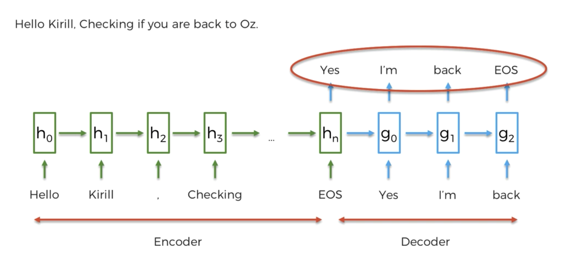

# Types of NLP

### Classical vs Deep Learning Models

Some examples:

1. if/else rules (chatbot)
2. audio frequency components analysis 
(speech-recognition)
3. bag-of-words (classification)
4. CNN for text recognition (classification)
5. seq2seq (many applications)

### End-to-end Deep Learning Models

### Bag-of-words

#### Drawbacks of bag-of-words Models

* Fixed-sized input
* Doesn't take word order into account
* Fixed-sized output

### Seq2seq

RNN architecture
